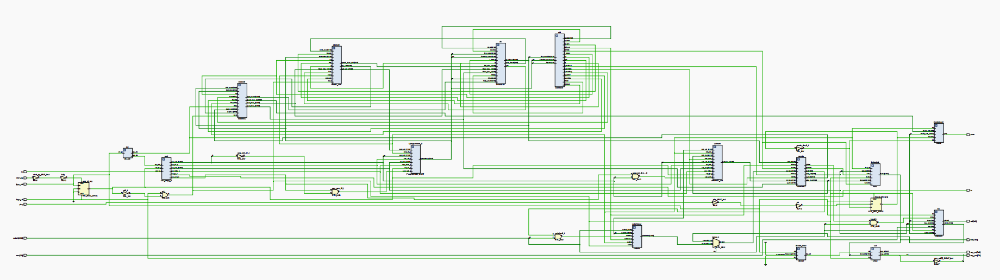
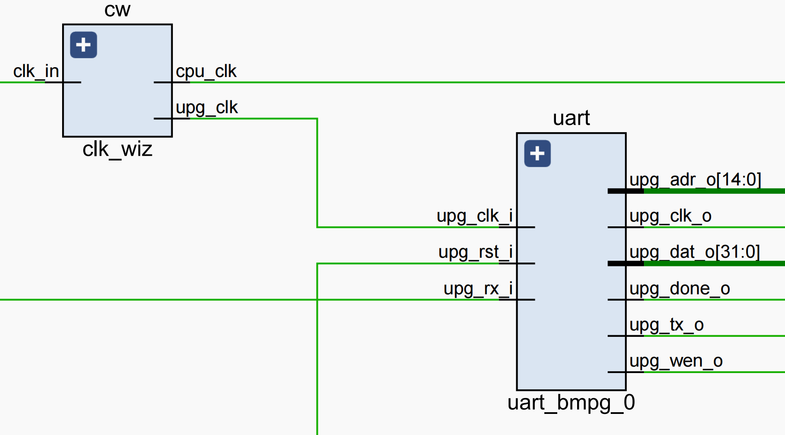
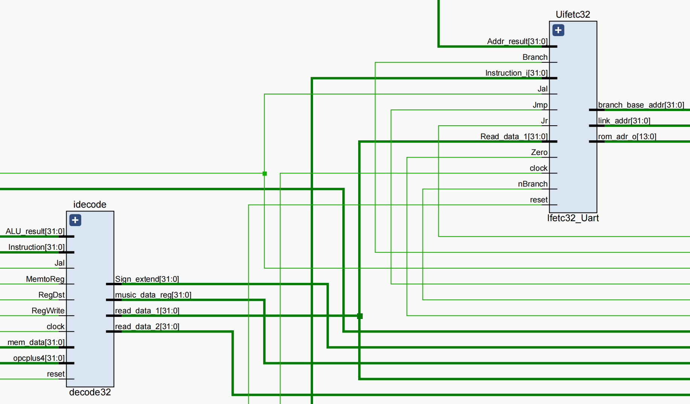
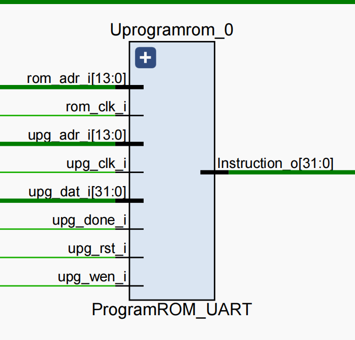
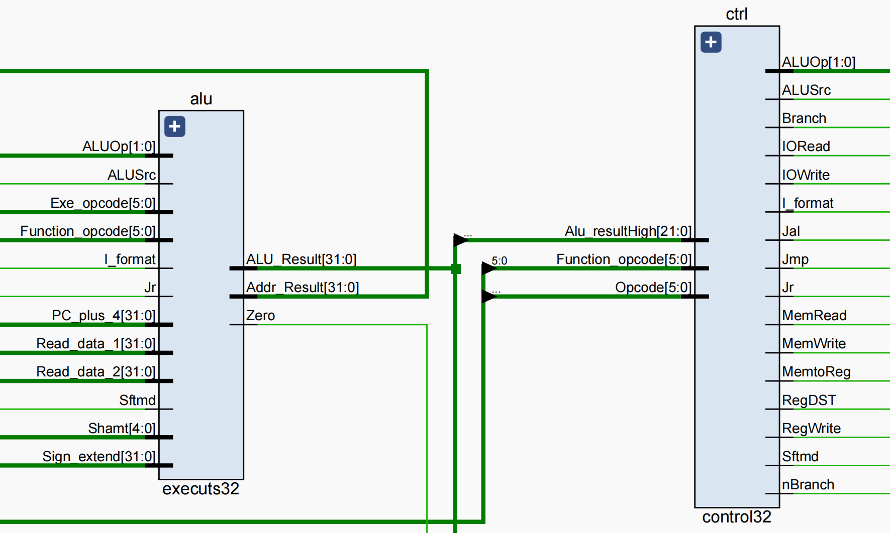
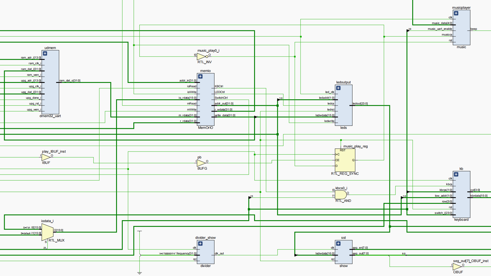

[toc]

## Part1-项目需求及开发者说明

### 1.1）项目需求

本次项目我们实现了一个CPU，支持Minisys的基本32条指令，可以解析传入的coe文件，并通过Minisys开发板与用户完成交互，接受用户输入并将结果显示在开发板上。

### 1.2）开发者说明

|          | 12110817 张展玮                           | 12110813 刘圣鼎                       | 12110714 谢嘉楠           |
| -------- | :---------------------------------------- | :------------------------------------ | :------------------------ |
| 负责任务 | CPU模块和MIPS场景二的前四部分、音乐播放器 | MIPS场景一、场景二的后四部分和键盘I/O | CPU模块、UART、音乐播放器 |
| 贡献占比 | 33.3%                                     | 33.3%                                 | 33.3%                     |


## Part2-版本更迭记录

https://github.com/ITBillZ/CS214-Computer-Organization-Project.git


## Part3-CPU架构设计说明

### 3.1）CPU特性

|                |                                                              |
| -------------- | ------------------------------------------------------------ |
| 所支持的ISA    | 参考了Minisys的指令集（共31条），提供了32个32位的寄存器      |
| 寻址空间设计   | 在此CPU中采用了哈佛结构，即指令储存与数据储存分开的方式。指令空间起始地址为prgrom的0x00000000, 数据空间起始地址为dmem的0x00000000, 它们的读写宽度都为32bits, 读写深度均为16384bits，外设IO的寻址范围为 0xFFFFFC00 至 0xFFFFFFFF，寻址单位均为一个字即4个字节。 |
| 对外设IO的支持 | 采用MMIO以及轮询的方式访问IO。使用switch和keyboard作为输入设备，led、七段数码管和蜂鸣器作为输出设备。输入的内存首地址是0xFFFFFC70，输出的内存首地址是0xFFFFFC60 |
| CPI            | 单周期CPU，不支持pipeline，CPI接近1                          |
| 栈空间方案     | 栈空间的位置（基地址）为0XFFFFFC00                           |

### 3.2）CPU接口

#### 时钟

在本CPU中使用到了开发板提供的100MHz时钟（Y18），通过IP核分别转化成为了10MHz（供单周期CPU使用）以及10MHz（供UART接口使用），占空比为50%的周期时钟信号。

#### 复位

在本CPU中，我们通过高电位信号来判断复位信号，并通过开发板的按钮外设来控制复位信号的输入。在按下复位按钮（P4）之后，CPU将会重新回到初始状态，之前的所有状态将会被清空。

#### UART接口

我们实现并提供了UART接口，该接口可以支持将生成好的COE文件发送给CPU。使用该接口需要按下CPU中设定好的用来控制通信状态的按钮（P1）来使CPU进入通信状态（此时，七段数码显示管第一位高亮来提示已经进入通信状态）。在此状态下之后，使用串口调试助手将指定文件发送给CPU，当显示发送完成的字样后，再次按下控制按钮（P4）来使CPU回到普通工作模式即可。在此还用到了Y19以及V18端口来分别作为数据的接受和发送端。

#### 数据输入&输出接口

- 控制输入方式接口：由于我们同时实现了键盘输入以及开关输入的方式，因此另实现一个控制接口来控制输入的方式。该接口绑定在开关Y9上，当置为高电平时为键盘输入，为低电平时为开关输入。

- 小键盘接口：实现了小键盘的输入，可以通过小键盘来输入对应数据（十六进制数）。其中，输入上限为4个十六进制数，通过两个开关W9和Y7分别控制键盘输入的数的位置。

- 七段数码显示管：在实现小键盘的基础上，为了输入的可视性，我们另实现了七段数码显示管接口，可以实时展示此时小键盘的输入数据和结果。

- 开关输入接口：sw16至sw18用来控制测试样例编号的输入，支持编号0-7的输入。sw0-sw15来控制16位立即数的输入），能够支持16位二进制数的输入。

- LED灯输出：我们使用了0-15号LED灯来作为数据输入时的指示以及计算结果的显示，当输入数据后，LED灯便会显示对应数据的二进制数，若为1则亮灯，反之不亮。同时使用sw16来作为奇偶校验、溢出检测等信号的指示灯。

- 蜂鸣器播放：我们使用按钮P5控制音乐的播放与暂停，通过拨码开关Y8控制音乐播放的模式（UART模式和内置模式）。蜂鸣器与管脚A19绑定。

### 3.3）CPU内部结构















### 3.4）CPU内部子模块的设计说明（模块名称、模块功能及功能说明）

| 模块名称        | 模块功能                                                     | 功能说明                                                     |
| --------------- | ------------------------------------------------------------ | ------------------------------------------------------------ |
| clk_wiz         | 将开发板的时钟信号调至10MHZ后输出                            | 输入开发板时钟信号，输出调整后的CPU clock以及供uart接口使用的时钟信号 |
| divider         | 有一个周期参数值，可以通过传入参数，进行不同的时钟分频       | 主要用于产生用于晶体管显示的时钟                             |
| BUFG            | 消除外设抖动                                                 | 对通信模式按钮和音乐播放按钮进行防抖处理，提高操作灵敏度     |
| uart_bmpg_0     | uart接口模块                                                 | 连接CPU和uart外设                                            |
| Ifetc32_Uart    | 通过传入的指令来计算并存储PC与Next_PC值                      | 通过分析指令的编码来判断PC与Next_PC值                        |
| ProgramROM_UART | 从指令存储中获取指令                                         | 通过ip核根据给予的参数来获取指令                             |
| decode32        | 含有32个32位寄存器用来存储数据，同时根据传入的参数计算出目标寄存器以及目标数据 | 通过传入的控制信号来判断目标寄存器以及目标数据               |
| control32       | 通过传入的参数产生各个控制信号给到下游模块作为指示           | 通过解析传入的opcode和function_code来给出控制信号            |
| executs32       | 计算单元，根据参数计算出地址以及数学计算结果                 | 通过控制信号计算出相应结果                                   |
| dmem32_uart     | 通过给予的参数从数据存储中获得数据                           | 包含ip核，同时与uart接口有关，接受uart的写入                 |
| MemOrIO         | 外设接口模块，控制数据输入输出流向                           | 通过控制信号判断流向，给出外设指定的IO数据地址               |
| leds            | 输出外设模块                                                 | 与MemOrIO交互，输出存储在输出内存空间的数据                  |
| switchs         | 输入外设模块                                                 | 与MemOrIO交互，数据存储到输入内存空间                        |
| keyboard        | 输入外设模块                                                 | 与MemOrIO交互，利用片选信号实现输入外设的切换，数据存储到输入内存空间 |
| show            | 输出外设模块                                                 | 与MemOrIO交互，输出存储在输出内存空间的数据                  |
| music           | 输出外设模块                                                 | 与MemOrIO交互，读取记录在内存空间的“乐谱”，并在系列操作后得到pwm实现音乐播放 |


## Part4-测试情况

### 4.1）测试总览

#### 4.1.1) 仿真测试

| 测试内容             | 测试结果 | 结论                                                         | 修改                                     |      |
| -------------------- | -------- | ------------------------------------------------------------ | ---------------------------------------- | ---- |
| Next_PC与PC的正确性  | 错误     | 更新Next_PC与PC的上升沿和下降沿设置错误，导致两者在信号为稳定时更新 | Next_PC的敏感信号设置为*，PC设置为下降沿 |      |
| 同上                 | 正确     | -                                                            | -                                        |      |
| jr的正确性           | 错误     | read_data_1的typo，导致此信号无法正常传递，jr跑飞            | 更正typo                                 |      |
| 同上                 | 正确     | -                                                            | -                                        |      |
| 其他基本指令的正确性 | 正确     |                                                              |                                          |      |
| 蜂鸣器的正确性       | 正确     |                                                              |                                          |      |


#### 4.1.2) 上板测试

| 测试内容                                                     | 测试结果 | 结论                   | 修改                 |      |
| ------------------------------------------------------------ | -------- | ---------------------- | -------------------- | ---- |
| 根据用户拨码开关输入的测试用例，直接通过LED灯执行输出        | 正确     |                        |                      |      |
| uart的正确性                                                 | 错误     | uart写入时地址偏移错误 | 修改写入时的地址偏移 |      |
| 同上                                                         | 正确     |                        |                      |      |
| 根据用户输入的测试用例，进入不同的功能模块。包括奇偶校验、位运算、四则运算、累加等。 | 正确     |                        |                      |      |
| 键盘输入的正确性                                             | 正确     |                        |                      |      |
| 蜂鸣器发声的正确性                                           | 正确     |                        |                      |      |


### 4.2）asm文件详细描述

#### 4.2.1)测试场景1

1.如何实现IO模块，与用户交互

```assembly
##采用MMIO的方式访问IO设备，其中：
##0XFFFFFC70作为输入的首地址
##0XFFFFFC60作为输出的首地址
start:
	lui $1,0xFFFF			
	ori $28,$1,0xF000
##通过轮询的方式访问IO，通过判断高八位的开关的状态选择进入哪一模块
loop:
	lw $1, 0xC72($28)	#left-8 switch in $1
	andi $1, $1, 7

	beq $1,$17,parity1	#000 0
	beq $1,$18,parity2	#001 1
	beq $1,$19,bitNor	#010 2
	beq $1,$20, bitOr	#011 3
	beq $1,$21, bitXor	#100 4
	beq $1,$22, uCompare		#101 5
	beq $1,$23, Compare	#110 6
	beq $1,$24, loadAndShow	#111 7
	
	
##读入数据
	lw   $2,0xC70($28)	#2号寄存器存放测试用例
##输出数据
	sw $25, 0xC62($28)  #此时25号寄存器存放奇偶校验位，溢出检验位等，最终显示在高八位的led灯和左侧七段数码管上
	sw $25, 0xC60($28)	 #此时25号寄存器存放运算的结果，最终显示在低16位的led灯和右侧七段数码管上
	
```

我们通过轮询的方式等待读入信号，当我们在开发板上输入完数据后，1号寄存器通过当前的输入决定进入哪一个模块，同时2号寄存器存放测试用例，25号寄存器用来存放测试结果

2.测试场景（奇偶校验）

```assembly
parity1:
	lw   $2,0xC70($28)	
	#obtain the first number a, get the first 8 bits and shift right 8 bits
	andi $2,$2,0xFF00
	sw   $2,0xC60($28)
	srl $2,$2,8		#a
	addi $3,$0,1            #test bit
	addi $5,$0,0		# $5:save the cnt of 1
loop1:
	addi $6, $0, 128	#128为低7位的奇偶校验，256为全部8位的奇偶校验
	beq $3,$6,Exit
	and $4,$2,$3
	beq $4,$3,isOne
	sll $3,$3,1
	j loop1
isOne:
	addi $5,$5,1
	sll $3,$3,1
	j loop1

Exit:
	andi $5,$5,1	#check if the cnt of 1 is odd
	addi $6, $0, 1
	beq $5,$6,off
	addi $25,$0,1
	sw $25, 0xC62($28)
	j loop
	addi $1,$1,0	#filler
off:
	addi $25,$0,0
	sw $25, 0xC62($28)
	j loop
```

偶校验，通过与操作和移位操作统计1的数量，偶数个1输出为1，奇数个1输出为0

3.测试场景（有符号数比较）

```assembly
Compare:
	lw   $2,0xC70($28)
	sw   $2,0xC60($28)
	add $3,$0,$2 
	andi $2,$2,0xFF00
	srl $2,$2,8		#a
	andi $3,$3,0x00FF	#b
	jal sign_extend	
	slt $4,$2,$3
	sw $4, 0xC62($28)
	j loop

###注意要对a,b两个数进行符号拓展
sign_extend:
	# param $2,$3, which stores a,b
	andi $9, $2, 0x0080
	beq $9, $0, continue
	lui $9, 0xffff
	ori $9, $9, 0xff00
	or $2, $2, $9
continue:
	andi $9, $3, 0x0080
	beq $9, $0, exit3
	lui $9, 0xffff
	ori $9, $9, 0xff00
	or $3, $3, $9
	jr $ra
exit3:
	jr $ra
```

#### 4.2.2)测试场景2

1.测试场景（如何闪烁）

```assembly
	addi $t7, $zero,2500
	addi $t9,$zero, 1500

	loop83:
	addi $t9, $zero,1500 
	loop84:
	addi $t5, $zero,1
	sub $t9, $t9, $t5 
	bne $t9, $zero, loop84
	sub $t7,$t7,$t5
	bne $t7 ,$zero, loop83
	jr  $31
```

这里我们采用的方式是塞一堆无用的指令让CPU运算，经过调整，发现该规模的二重循环符合要求

2.测试场景（检验溢出）

```assembly
addition:
	sw $0,0xC62($28)
	lw $2,0xC70($28)	#right-16 switch in $2
	add $3,$0,$2 
	andi $2,$2,0xFF00
	srl $2,$2,8		#a
	andi $3,$3,0x00FF	#b
	jal  sign_extend	##首先符号拓展，因为有符号数
	add $4,$2,$3
	andi $5, $4, 0x00FF
	sw $5,0xC60($28)
	#判断最终的结果是否在-2^7~2^7-1  -128~127
	addi $2, $0, 127
	addi $3, $0, -128
	slt $6, $2, $4
	beq $6,$18,overflow
	slt $6,$4,$3
	beq $6,$18,overflow
	addi $25,$0,0
	sw  $25,0xC62($28)
	j loop
	addi $1,$1,0	#filler
overflow:
	addi $25,$0,1
	sw  $25,0xC62($28)
	j loop
	addi $1,$1,0	#filler
```

对于8位有符号数的加法与减法的溢出检测，只需判断最终的结果是否在-128~127以内。以上代码为检验8位有符号数的加法以及是否溢出的操作，减法的操作同理

3.情景测试(8位有符号数的乘法)

```assembly
multiplication:
	sw $0,0xC62($28)
	lw $2,0xC70($28)	#right-16 switch in $2
	add $3,$0,$2 
	andi $2,$2,0xFF00
	srl $2,$2,8		#a
	andi $3,$3,0x00FF	#b
	jal  sign_extend	##首先符号拓展
	addi $4, $0, 0x80
#判断符号位
	and $5,$2,$4
	srl $5,$5,7 
	beq $5,$0,label
	sub $2,$0,$2
	label:
	and $6,$3,$4
	srl $6,$6,7 
	beq $6,$0,label2
	sub $3,$0,$3
	label2:
	jal multi
#判断乘积的正负
	xor $4,$5,$6
	beq $4,$zero,exit6
	nor $8,$8,$8
	addi $8,$8,1
	sw $8,0xC60($28)
	j loop
	addi $1,$1,0	#filler
exit6:	
	sw $8,0xC60($28)
	j loop
	addi $1,$1,0	#filler
	
```

```assembly
multi:
#$8: store the product
	add $8,$0,$0
	add $10,$0,$0
	addi $9,$0,8	#8 is the length in binary
	loopp:
	and $7,$18,$3 #to determine the lowest bit of $s1
	beq $7, $0, jumpAdd
	add $8, $2, $8
	jumpAdd:
	sll $2,$2,1
	srl $3,$3,1
	addi $10,$10,1
	slt $11, $10, $9
	bne $11, $0, loopp

	# add $a0,$0,$8

	jr $ra
```

对于8位有符号数的乘法，我们通过软件实现。首先，对两个8位的有符号数（所以记得符号拓展）取符号位，通过符号位的异或操作来决定最终乘积的正负。然后对两个有符号数取绝对值，接着利用无符号数的朴素乘法计算出乘积的绝对值，最后结合符号位，给出最终的结果，如果为负数，给出负数的补码形式。

4.情景测试(8位有符号数的除法)

```assembly
division:
	sw $0,0xC62($28)
	lw $2,0xC70($28)	#right-16 switch in $2
	add $3,$0,$2 
	andi $2,$2,0xFF00
	srl $2,$2,8		#a
	andi $3,$3,0x00FF	#b
	jal  sign_extend
	addi $4, $0, 0x80
#取出两个数的最高位,对两个数取绝对值
	and $5,$2,$4
	srl $5,$5,7 
	beq $5,$0,labe3
	sub $2,$0,$2
	labe3:
	and $6,$3,$4
	srl $6,$6,7 
	beq $6,$0,label4
	sub $3,$0,$3
	label4:
	jal  divi
#判断最后的商为正还是负
	xor $4,$5,$6
	beq $4,$zero,next

#如果商为负数，对商取补码
	nor $8,$8,$8
	addi $8,$8,1

#余数的符号要与被除数保持一致
next:
	beq $5,$zero,fuck
	nor $9,$9,$9
	addi $9,$9,1
#得到最终结果的商和余数，分别存在寄存器$8,$9中
########	#############################################################
##########如何实现商和余数的交替显示，每个持续5s###########################
fuck:
	andi $8,$8,0xff
	sw $8,0xC60($28)
	jal show5s
	andi $9,$9,0xff
	sw $9,0xC60($28)
	jal show5s
	j loop
	addi $1,$1,0	#filler

```

```assembly
divi:
#$8: store the quotient $9:store the reminder
	sll $3,$3,8 # $3 : dividor
	add $9,$2,$zero  # $9 store the remainder
	add $8,$0,$0 # $8: Quot
	add $10,$0,$0 # $10: loop cnt
	addi $7,$zero,9 #$7:: looptimes
loopb: 
# $2: dividend, $3: divisor, $9: remainder, $8: quot
# $10:cnt of loops $7: 9
	sub $9,$9,$3 #dividend - dividor
	andi $s0,$9,0x8000 # get the higest bit of rem to check if rem<0
	sll $8,$8,1 # shift left quot with 1bit
	beq $s0,$0, SdrUq # if rem>=0, shift Div right
	add $9,$9,$3 # if rem<0, rem=rem+div
	srl $3,$3,1
	addi $8,$8,0
	j loope
SdrUq:
	srl $3,$3,1
	addi $8,$8,1
loope:
	addi $10,$10,1
	bne $10,$7,loopb
	jr  $31
```

5.情景测试(如何实现商和余数的5s交替显示)

```assembly
	andi $8,$8,0xff
	sw $8,0xC60($28)
	jal show5s
	andi $9,$9,0xff
	sw $9,0xC60($28)
	
	show5s:	
	addi $t7, $zero,10000
	addi $t9,$zero, 1500

	loop73:
	addi $t9, $zero,1500
	loop74:
	addi $t5, $zero,1
	sub $t9, $t9, $t5
	bne $t9, $zero, loop74
	sub $t7,$t7,$t5
	bne $t7 ,$zero, loop73
	jr  $31
```

对于8位有符号数的除法，我们依旧通过软件实现，只不过除法的实现相对比较复杂。

首先，对输入的两个8位的有符号数进行符号拓展

其次，对两个8位的有符号数取其绝对值

然后，利用无符号数的朴素除法计算出商和余数的绝对值

最后，对两个8位的有符号数取符号位，通过符号位的异或操作来决定最终商的正负，注意余数的符号应该与被除数保持一致。结合符号位，给出最终的结果，如果为负数，给出负数的补码形式。


## Part5-bonus

#### 5.1）实现对复杂外设接口的支持，在我们的Project中为对小键盘、七段数码管复杂外设接口的支持  

- 为了在我们的项目中支持小键盘和七段数码管这两个复杂外设接口，我们采用了以下方案。
  - 首先，我们定义了输入和输出的内存地址，以便与这些外设进行通信。对于小键盘，我们将输入的内存首地址设置为0xFFFFFC70。当用户按下键盘上的按键时，相应的键值将被存储在这个内存地址中，供我们的程序读取。
  - 对于七段数码管，我们将输出的内存首地址设置为0xFFFFFC60。我们的程序可以将需要显示的数字或字符写入这个内存地址，然后七段数码管将根据这些数据进行相应的显示。
  - 此外，我们还定义了I/O的起始地址为0XFFFFFC00。这个起始地址用于与外设进行交互。我们可以通过读写这个地址来与外设进行数据的传输和控制。  
- 为了确保这些外设接口的正确性和可靠性，我们小组提供了详细的测试用例。
  - 针对小键盘，我们编写了测试代码，模拟用户按下不同的按键，并验证相应的键值是否正确地存储在指定的内存地址中。
  - 对于七段数码管，我们编写了测试代码，将不同的数字和字符写入指定的内存地址，并验证七段数码管是否正确地显示了这些数据。
- **遇到的问题、总结、思考**
  - 两个输入设备的内存地址的分配：原本我们想对小键盘和拨码开关定义特定的内存地址，以便与其进行通信。但是在设计过程中，我们发现共用一块内存地址即可，通过一个特定的用于控制的拨码开关来控制是拨码开关输入还是小键盘输入。这样在加入键盘之后，可以不用修改MIPS代码。
  - 控制小键盘输入的位置：由于小键盘一次只能够输入4-bit的数据，然而有些测试场景可能需要输入16-bit的数据，所以我们需要思考怎样用键盘输入16-bit的数据。我们最后采用的方案是通过两个拨码开关进行片选，控制输入1,2,3,4个位置的数据。此外，我们还了解到一些其他的方法，如使用按键确定、使用按键移位、删除等功能。但是由于时间不足，只完成了通过按键片选的功能。

#### 5.2）实现了音乐播放器功能，可以通过调整PWM，使蜂鸣器播放音乐；以及通过UART传入乐谱播放音乐  

- 我们采用了两种方式来实现音乐播放：通过调整PWM信号和通过UART传入乐谱。  
  - 我们利用PWM（脉冲宽度调制）信号来控制蜂鸣器的音调和音量。通过调整PWM信号的频率和占空比，我们可以生成不同音高和音量的声音。我们的程序可以根据输入的音乐信息，计算出相应的PWM参数，并将其应用于蜂鸣器控制信号。这样，蜂鸣器就能按照乐曲的要求播放相应的音乐。  
  - 我们还支持通过UART接口传入乐谱来播放音乐。用户可以将乐谱数据通过UART串口发送给我们的系统。我们的程序将解析接收到的乐谱信息，并根据其中的音符、音长和节奏等参数生成相应的PWM参数，以便蜂鸣器能够按照乐谱正确地演奏音乐。通过这种方式，用户可以通过拨码开关和按钮与CPU进行通信，实现音乐的播放控制。  
- 为了确保音乐播放器功能的正确性，我们提供了相应的测试用例。我们编写了测试代码，模拟输入不同的音乐信息，包括音符、音长、节奏等参数，并验证蜂鸣器是否能够按照预期的方式播放相应的音乐。我们还测试通过UART接口发送乐谱数据，并验证系统是否能够正确解析和播放这些乐谱。通过这些测试用例，我们可以验证音乐播放器功能的可靠性和正确性。
- **遇到的问题、总结、思考**
  - 输出特定旋律、节奏的音频：在查阅资料后，我们得到了低八度到高八度的21个音调的近似频率，在music_mem模块中我们预设提供这21个音调所需的分频比，从而实现了单音符的音频模拟输出。而基于此，我们添加music_ctrl模块用于控制每个音符之间输出的间隔时间，从而实现节奏控制。最后，我们将乐谱拆分成每个音符，按照我们设定的节奏，实现特定旋律、节奏音频播放。
  - 软硬件协同实现UART下发乐谱：最初设想为实现music_mem模块与MemOrIO模块的交互，预先读取存储整个乐谱在music_mem模块之中，从而实现任意大小、节奏、旋律的乐谱下发，根据乐谱music各子模块协同配合输出音频。但在实现过程中有一点小bug短时间内解决不了，碍于时间关系，我们利用mips指令，通过循环特定次数实现音符间隔时间控制，即节奏控制。并将需要播放的音符存储到第27号寄存器，然后将这个寄存器的值传入music模块，实现单音符的音频模拟输出。但这种实现有个小问题在于不易精准计算得出音符间隔时间，不好设计mips代码实现复杂乐谱的下发。
  - 自由切换软硬件音乐播放以及播放与暂停：利用片选信号实现选择输出硬件预存乐谱的音符还是软件下发乐谱的音符，并将此信号与开关绑定实现软硬件音乐播放的自由切换。利用复位信号控制音乐播放模块工作与否，并将此信号与按钮进行绑定实现单按钮控制音乐播放与暂停。

#### 5.3）基于CPU的软硬件协同的应用  

- 我们实现了一种基于CPU的软硬件协同应用，通过指令中的地址信息（MMIO）来访问相关的复杂外设，从而实现了复杂外设接口的访问。具体而言，我们的系统可以通过在指令中指定特定的MMIO地址来进行对外设的读写操作。通过这种协同应用，我们能够更灵活地控制和操作外设。这样，我们可以实现对复杂外设的控制和管理，提供更多功能和扩展性。 
-  此外，我们还实现了通过UART下发乐谱的功能，使Minisys的蜂鸣器可以演奏对应的乐曲。通过UART接口，我们可以将乐谱数据发送给系统，然后通过软硬件协同应用来解析和处理这些乐谱数据。解析后的数据将被转换为相应的PWM参数，以控制蜂鸣器演奏出正确的音乐。


## Part6-开发过程中遇到的问题、思考、总结

#### 6.1）小组成员：刘圣鼎

在MIPS编写asm文件的过程中，遇到的第一个问题是我在编写asm文件的时候该如何访问IO，由于刚开始对于MMIO的理解还不够，所以就比较困惑我该怎么去读入输入设备，从哪读入，以及最终我的结果应该怎么反应在输出设备上，输出到哪里。后来，在翻看Lab的PPT以及对MMIO理解进一步加强后，这个问题就迎刃而解了。

在测试场景1中，比较难一点的是有符号数的比较这一模块，对于它的debug也浪费了很长一段时间。当时的想法很简单，认为既然我Vivado已经给硬件编写好了有符号数的比较，那我直接compare不就行了，但是忽略了一点，因为两个有符号数都是8位，所以在之后的load和and操作以后，它们的高位其实都是补0的，所以如果不对其进行符号拓展的话，它们在后续的有符号比较肯定是会出错的，这时候就需要额外写一个符号拓展的方法去将其从8位有符号数拓展成32位的有符号数，然后去Compare。

在测试场景2中，难点有两方面。第一是如何实现led灯的闪烁和交替显示，它们的本质都是相同的，即通过一些列无用的操作去让输出的状态锁住，不同的是如何调整这些无用操作的数量，通过合理的调整这些无用的操作数量便可以实现对应时间的闪烁和交替显示。第二是在于有符号数的乘除法上面，刚刚开始没有一个特别好的思路去处理，后来想到了Lab课上无符号数的乘除法，从那上面获得了启发，那么我无非就是把有符号数转化成无符号数嘛，因此将两个操作数分别取绝对值，再对最终的结果按照符号位进行补码操作，因此测试场景2也迎刃而解。但是在寻找思路以及代码的实现细节方面还是蛮花费时间的。

然后一个很重要的体会就是软硬件一定要协同配合。因为一旦最终体现在板子上的结果出现了错误，那么我们就需要考虑到底是CPU的问题还是编写的MIPS的问题，如果是MIPS上面的问题倒是还好，因为这个bug是相对容易发现的，然而，如果不是MIPS的问题，而是CPU的问题，这时候硬件和软件都会很紧张，然后就会出现我MIPS在本地测试怎么测试都是对的，但是还是不自信反复的核对自己MIPS的代码是否出问题，虽然这些其实最后都是无用功。另外，UART的实现很重要，所以这也是前期我们进度比较慢的原因，由于不能下发coe文件，每次烧写都需要花费比较长的时间，后面UART的问题解决，速度直接翻倍。这些经验告诉我们软硬件任何一个方面出了问题都不行，最终一个Project的完成一定是需要一个robust的硬件和软件的同时实现。

同时，关于版本控制。由于我们出现了2次比较打击的事情都是修改着修改着发现改崩了的情况，其原因并不是我们没有git，大概是因为我们一次性做了较大的改动而没有及时上板测试CPU的功能或者进行仿真然后git或者是因为大家修改同一个文件然后git的时候发生了一些冲突。所以在以后的project中，特别是需要协调配合、环环相扣的部分，一定要稳扎稳打，不可操之过急，同时要与队友沟通好改动的部分，以免出现冲突。

#### 6.2）小组成员：谢嘉楠

在开发过程中最痛苦的就是debug的环节。vivado没有其他IDE那样提供足够友善的debug工具，当上板测试后发现没有达到预期效果时，必须从头仔细看一遍代码并在心里模拟模块运行过程。在后续发现了仿真的强大之处，但可惜的是并没有在一开始就将仿真测试与烧写测试结合在一起，导致前面浪费了很多时间。此外在实现uart通信接口时无法进行仿真模拟，debug成为一个黑箱操作，在当时实在让人迷茫了许久，直到彻底完全理解uart的ip核运行机制后才解决了问题。有了这些惨痛教训后，在设计外设模块时，我们都将这些外设模块合并成一个顶层模块并提供接口供CPU使用，这保证了单外设的崩溃不会导致cpu的崩溃，而我们只需要仿真测试单接口即可，这为debug的过程节省了不少时间。

#### 6.3）小组成员：张展玮

虽然之前已经被数字逻辑使用verilog折磨过，我本以为这次verilog写得会顺利一些。然而现实是，verilog仍然是我们在做project面临的最大困难之一。难以debug，烧写时间长，对各模块之间的关系不够熟悉，对上升下降沿的理解不够透彻等，这些问题，都是可以让我debug一整天的存在。在这个过程中，我总结了一些经验：

- 调试困难：Verilog编写的调试确实可能会很具有挑战性。对于复杂的设计，特别是在涉及多个模块和时序问题时，调试变得尤为困难。重要的是要运用有效的调试技巧，如使用仿真工具进行逐步调试、添加调试输出语句以跟踪信号值、通过波形查看器进行信号分析等。此外，建立良好的代码结构和注释也有助于提高可读性和可维护性。
- 模块关系和时序问题：对于复杂的设计，深入了解各个模块之间的关系和时序约束非常重要。这包括正确理解信号的传输路径、时钟边沿触发的影响以及确保时序约束的满足等。在编写Verilog代码之前，建议进行详细的设计规划和时序分析，并使用专业的时序约束语言来确保正确的时序行为。

- 上升和下降沿的理解：Verilog中的时钟边沿对于设计的正确性至关重要。对于时钟边沿的理解不够透彻可能导致设计中的错误或奇怪的行为。


## Part7-视频

<video width="1280" height="600" controls>
    <source src="image/video.mp4" type="video/mp4">
</video>
